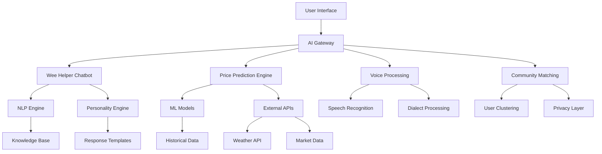

# Technical Implementation Roadmap for AI-Powered NiHeatingOil.com

## Overview

This document provides a detailed technical roadmap for implementing the AI-powered features outlined in the Northern Ireland AI UX Improvements plan. Each phase includes specific technical requirements, integration points, and development milestones.

## 🏗️ Technical Architecture

### Core AI Infrastructure



### Technology Stack

- **Frontend**: React/Next.js with TypeScript
- **Backend**: Node.js with Express/Fastify
- **AI/ML**: 
  - OpenAI GPT-4 for conversational AI
  - Custom TensorFlow models for price prediction
  - Google Cloud Speech-to-Text with custom dialect training
- **Database**: PostgreSQL with TimescaleDB for time-series data
- **Caching**: Redis for session management
- **Message Queue**: RabbitMQ for async processing
- **Monitoring**: Prometheus + Grafana

## 📅 Phase 1: Foundation (Months 1-2)

### Week 1-2: AI Infrastructure Setup

```typescript
// Example: Basic chatbot infrastructure
interface ChatbotConfig {
  personality: 'full_craic' | 'professional' | 'minimal';
  dialectRecognition: boolean;
  contextWindow: number;
}

class WeeHelper {
  private nlpEngine: NLPEngine;
  private personalityEngine: PersonalityEngine;
  private knowledgeBase: KnowledgeBase;
  
  constructor(config: ChatbotConfig) {
    this.nlpEngine = new NLPEngine({
      dialectSupport: ['northern_irish', 'standard_english'],
      customPhrases: northernIrishPhrases
    });
    
    this.personalityEngine = new PersonalityEngine({
      mode: config.personality,
      localReferences: belfastLandmarks
    });
  }
  
  async processMessage(message: string, context: ConversationContext) {
    const intent = await this.nlpEngine.detectIntent(message);
    const response = await this.generateResponse(intent, context);
    return this.personalityEngine.apply(response);
  }
}
```

### Week 3-4: Northern Irish NLP Training

```python
# Training data for local dialect recognition
training_data = [
    {"text": "bout ye", "intent": "greeting"},
    {"text": "what's the craic", "intent": "greeting"},
    {"text": "I'm foundered", "intent": "cold_weather"},
    {"text": "baltic out there", "intent": "cold_weather"},
    {"text": "my tank's banjaxed", "intent": "tank_problem"},
    {"text": "need a wee top up", "intent": "order_oil"}
]

# Custom entity recognition for local terms
entities = {
    "measurements": {
        "five hunnert": 500,
        "a thousand": 1000,
        "half a tank": "50%"
    },
    "locations": {
        "the port": "portrush",
        "the north": "northern_ireland"
    }
}
```

### Week 5-6: Basic Price Prediction Model

```python
# Price prediction model architecture
import tensorflow as tf
from tensorflow.keras import layers

def create_price_prediction_model():
    model = tf.keras.Sequential([
        layers.LSTM(128, return_sequences=True),
        layers.LSTM(64),
        layers.Dense(32, activation='relu'),
        layers.Dropout(0.2),
        layers.Dense(1)
    ])
    
    model.compile(
        optimizer='adam',
        loss='mse',
        metrics=['mae']
    )
    
    return model

# Feature engineering
features = [
    'historical_prices',
    'weather_forecast',
    'season',
    'day_of_week',
    'crude_oil_prices',
    'gbp_usd_rate',
    'local_demand_index'
]
```

### Week 7-8: Integration and Testing

- Set up API endpoints for chatbot interactions
- Implement basic personality modes
- Create fallback mechanisms for AI failures
- Develop admin dashboard for monitoring

## 📅 Phase 2: Enhancement (Months 3-4)

### Week 9-10: Community Savings Algorithm

```typescript
// Community matching algorithm
class CommunityMatcher {
  async findNearbyBuyers(user: User, radius: number = 5): Promise<Match[]> {
    const nearbyUsers = await this.getUsersInRadius(user.location, radius);
    
    return nearbyUsers
      .filter(u => this.isActivelyLooking(u))
      .filter(u => this.respectsPrivacy(u, user))
      .map(u => this.createMatch(user, u))
      .sort((a, b) => b.savingsPotential - a.savingsPotential);
  }
  
  calculateGroupDiscount(participants: number): number {
    // Tiered discount structure
    if (participants >= 10) return 0.07; // 7% discount
    if (participants >= 5) return 0.05;  // 5% discount
    if (participants >= 3) return 0.03;  // 3% discount
    return 0;
  }
}
```

### Week 11-12: Weather Integration

```javascript
// Weather-based recommendations
const weatherRecommendations = {
  async getRecommendation(location, currentTankLevel) {
    const forecast = await weatherAPI.getForecast(location, 7);
    const coldDays = forecast.filter(day => day.minTemp < 0).length;
    
    if (coldDays >= 3 && currentTankLevel < 30) {
      return {
        urgency: 'high',
        message: "Baltic weather ahead! You'll be using more oil - best top up now",
        recommendation: 'order_now'
      };
    }
    
    // More conditions...
  }
};
```

### Week 13-14: Advanced Personality Features

```typescript
// Dynamic personality responses
const personalityTemplates = {
  full_craic: {
    greeting: [
      "Bout ye! {time_greeting}",
      "What's the craic? {time_greeting}",
      "Well, how's the form? {time_greeting}"
    ],
    price_alert: [
      "Here mucker! Prices just dropped {amount} - you'd be mad not to grab this!",
      "Would you look at that - prices are down {amount}! Time to fill her up!",
      "Jaysus, prices dropped {amount}! Your wallet will thank you!"
    ],
    weather_warning: [
      "It's gonna be Baltic {day} - {temp}°C! Better check that oil tank!",
      "Foundered weather coming {day}! Time for a wee top-up?",
      "Brass monkeys weather ahead - {temp}°C on {day}!"
    ]
  }
};
```

### Week 15-16: Voice Recognition Setup

```python
# Custom speech recognition for Northern Irish accent
import speech_recognition as sr
from transformers import Wav2Vec2ForCTC, Wav2Vec2Processor

class NorthernIrishSpeechRecognizer:
    def __init__(self):
        self.processor = Wav2Vec2Processor.from_pretrained("facebook/wav2vec2-base")
        self.model = self.load_custom_model("models/ni_accent_model")
        self.dialect_mapper = {
            "hunnert": "hundred",
            "liters": "litres",
            "aye": "yes",
            "naw": "no"
        }
    
    def transcribe(self, audio_file):
        # Process audio
        inputs = self.processor(audio_file, return_tensors="pt", padding=True)
        logits = self.model(inputs.input_values).logits
        
        # Decode
        predicted_ids = torch.argmax(logits, dim=-1)
        transcription = self.processor.decode(predicted_ids[0])
        
        # Apply dialect mapping
        return self.apply_dialect_mapping(transcription)
```

## 📅 Phase 3: Advanced Features (Months 5-6)

### Week 17-18: Smart Home Integration

```javascript
// IoT tank monitor integration
class SmartTankMonitor {
  constructor(userId, tankId) {
    this.mqtt = new MQTTClient({
      broker: process.env.MQTT_BROKER,
      topic: `tanks/${userId}/${tankId}`
    });
    
    this.alertThresholds = {
      critical: 10,  // 10% - urgent
      low: 25,       // 25% - plan ahead
      optimal: 40    // 40% - good time to order
    };
  }
  
  async processReading(level) {
    const alert = this.determineAlert(level);
    
    if (alert) {
      await this.notifyUser(alert);
      
      if (alert.type === 'critical') {
        await this.suggestEmergencySuppliers();
      } else if (alert.type === 'optimal') {
        await this.checkPricesAndSuggest();
      }
    }
  }
}
```

### Week 19-20: Predictive Analytics Enhancement

```python
# Advanced customer behavior prediction
class CustomerBehaviorPredictor:
    def __init__(self):
        self.model = self.load_model('customer_behavior_lstm')
        
    def predict_next_order(self, customer_id):
        features = self.extract_features(customer_id)
        
        # Features include:
        # - Historical order intervals
        # - Seasonal patterns
        # - Weather correlation
        # - Tank size
        # - Property type
        # - Previous consumption rates
        
        prediction = self.model.predict(features)
        
        return {
            'days_until_order': prediction['days'],
            'confidence': prediction['confidence'],
            'expected_volume': prediction['volume'],
            'price_sensitivity': prediction['price_sensitivity']
        }
```

### Week 21-22: Full Voice Ordering

```typescript
// Complete voice ordering flow
class VoiceOrderingSystem {
  async processVoiceOrder(audioStream: Stream) {
    // Step 1: Transcribe
    const transcript = await this.recognizer.transcribe(audioStream);
    
    // Step 2: Extract order details
    const orderIntent = await this.nlp.extractOrderIntent(transcript);
    
    // Step 3: Confirm details
    const confirmation = await this.synthesizeConfirmation(orderIntent);
    
    // Step 4: Process response
    const userConfirmation = await this.waitForConfirmation();
    
    if (userConfirmation.confirmed) {
      return await this.placeOrder(orderIntent);
    }
    
    return this.handleCancellation();
  }
  
  synthesizeConfirmation(order: OrderIntent): string {
    return `Right, so that's ${order.volume} litres to ${order.address}, 
            with ${order.supplier} for £${order.totalPrice}. 
            They can deliver ${order.deliverySlot}. 
            Will I book that for you?`;
  }
}
```

### Week 23-24: System Integration & Launch Prep

- End-to-end testing of all AI features
- Load testing for concurrent users
- Security audit of AI systems
- Documentation and training materials

## 🔧 Technical Considerations

### Performance Optimization

```javascript
// Response caching for common queries
const responseCache = new LRUCache({
  max: 1000,
  ttl: 1000 * 60 * 60 // 1 hour
});

// Query optimization
const optimizedQueries = {
  getNearbyPrices: `
    SELECT supplier_id, price, last_updated
    FROM prices
    WHERE ST_DWithin(location, $1, $2)
    AND last_updated > NOW() - INTERVAL '1 hour'
    ORDER BY price ASC
    LIMIT 10
  `
};
```

### Security & Privacy

```typescript
// Privacy-preserving community matching
class PrivacyManager {
  anonymizeUserData(user: User): AnonymizedUser {
    return {
      id: this.generatePseudoId(user.id),
      area: this.generalizeLocation(user.postcode),
      orderFrequency: this.bucketize(user.orderFrequency),
      // No PII exposed
    };
  }
  
  encryptSensitiveData(data: any): EncryptedData {
    return crypto.AES.encrypt(
      JSON.stringify(data),
      process.env.ENCRYPTION_KEY
    );
  }
}
```

### Monitoring & Analytics

```javascript
// AI performance monitoring
const aiMetrics = {
  chatbotAccuracy: new Histogram({
    name: 'chatbot_intent_accuracy',
    help: 'Accuracy of intent detection'
  }),
  
  responseTime: new Histogram({
    name: 'ai_response_time',
    help: 'Time to generate AI response',
    buckets: [0.1, 0.5, 1, 2, 5]
  }),
  
  userSatisfaction: new Gauge({
    name: 'user_satisfaction_score',
    help: 'User satisfaction with AI interactions'
  })
};
```

## 🚀 Deployment Strategy

### Progressive Rollout

1. **Alpha Testing** (5% of users)
   - Staff and selected beta testers
   - Full feature access with close monitoring

2. **Beta Release** (20% of users)
   - Gradual rollout to active users
   - A/B testing of personality modes

3. **General Availability** (100% of users)
   - Full launch with all features
   - Continuous monitoring and optimization

### Infrastructure Requirements

- **Compute**: Auto-scaling Kubernetes cluster
- **GPU**: NVIDIA T4 GPUs for ML inference
- **Storage**: 10TB for historical data and models
- **Bandwidth**: 10Gbps for voice processing
- **Redundancy**: Multi-region deployment for HA

## 📊 Success Criteria

### Technical KPIs

- API response time < 200ms (p95)
- Chatbot accuracy > 90%
- Voice recognition accuracy > 85%
- System uptime > 99.9%
- Price prediction MAE < 5%

### Business KPIs

- User engagement increase: 40%
- Conversion rate improvement: 25%
- Customer support ticket reduction: 50%
- User satisfaction score > 4.5/5
- ROI within 12 months

## Conclusion

This technical roadmap provides a structured approach to implementing AI-powered features that combine cutting-edge technology with authentic Northern Irish personality. By following this phased approach, NiHeatingOil.com will transform into an intelligent, conversational platform that delights users while delivering real business value.

The key to success lies in balancing technical sophistication with cultural authenticity, ensuring that our AI doesn't just work well – it feels like home.

*"Sure, we're not just building AI – we're building an AI that knows the craic!"*